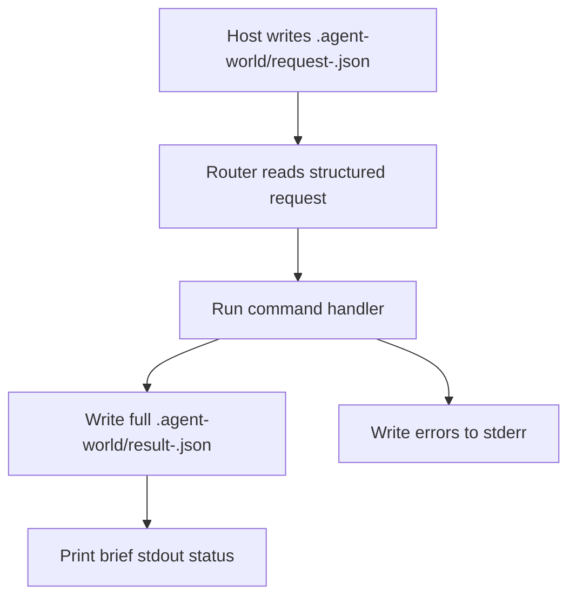

# Plan: File-Based Handoff

## Scope

Move the documented Agent World host contract to file-based structured handoff while preserving the existing router behavior for compatibility.

## Architecture

The router should expose a file-mode entrypoint that interprets timestamped `.agent-world/request-*.json` files, runs the same command handlers used by the current CLI, writes the full router payload to timestamped `.agent-world/result-*.json` files, and prints only a concise status line.

## Tasks

- [x] Inspect relevant files
- [x] Make focused changes
- [x] Run validation
- [x] Update docs/status

## Test Strategy

Use focused router tests for the new file contract and then run the existing full router suite:

- `node --test tests/agent-world-router.test.js tests/mention-routing.e2e.test.js`
- `node --check scripts/agent-world-router.js`
- `git diff --check`

## Non-Goals

- Do not redesign Agent World routing.
- Do not remove the existing command-line compatibility path unless required by tests.
- Do not add dependencies for JSON file handling.
