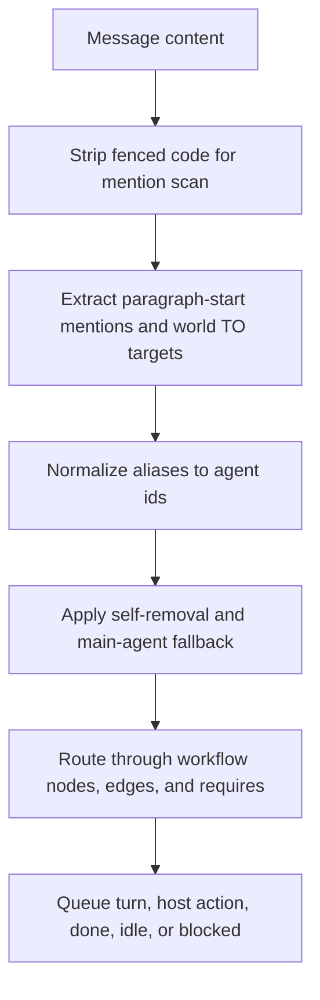

# Plan: Mention Routing Rules

## Scope

Implement the documented mention rules in `scripts/agent-world-router.js` while preserving the workflow DAG as the authority for legal handoffs.

## Architecture

The router should treat mention parsing as a normalization layer before DAG routing:

World completion tags are control signals. They should end the run before host action or mention routing.

## Tasks

- [x] Inspect relevant files
- [x] Make focused changes
- [x] Run validation
- [x] Update docs/status

## Test Strategy

Use `node --test tests/agent-world-router.test.js`. Add targeted unit tests for the newly implemented routing semantics. No separate E2E spec is needed because this is router-internal behavior with deterministic CLI unit tests.

## Non-Goals

- Do not replace DAG routing with broadcast subscriber routing.
- Do not add a new YAML parser dependency.
- Do not alter agent execution or host action payload contracts.
