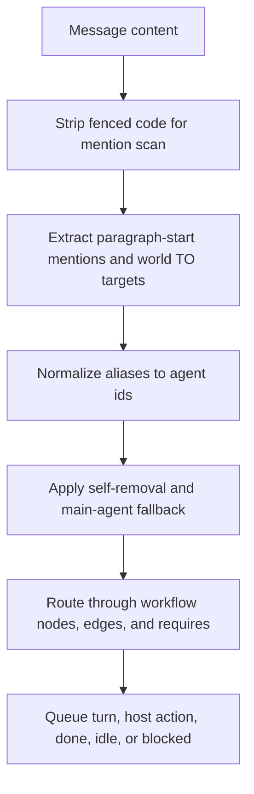

# Plan: Mention Routing Rules

## Scope

Implement the documented mention rules in `scripts/agent-world-router.js` while preserving the workflow DAG as the authority for legal handoffs.

## Architecture

The router should treat mention parsing as a normalization layer before DAG routing:

World completion tags are control signals. They should end the run before host action or mention routing.

## Tasks

- [x] Inspect relevant files
- [x] Make focused changes
- [x] Run validation
- [x] Update docs/status

## Test Strategy

Use `node --test tests/agent-world-router.test.js tests/mention-routing.e2e.test.js`.

Keep the focused router tests for individual regressions. Add a separate E2E file that drives the router CLI through realistic conversation turns and verifies full workflow outcomes. The E2E suite must contain at least 20 executable cases.

E2E scenarios:

- Full DAG run with normalized display-name mentions, code-fence ignored mentions, host-action precedence, `world TO` fan-out, join prerequisites, and completion tags.
- Human no-mention entry through `world.mainAgent`.
- Normalized off-edge mentions produce `workflow_edge_blocked` instead of bypassing the DAG.
- Completion tags win over host actions and routing.
- Human edge restrictions and allowances.
- Leading whitespace and greeting punctuation.
- Snake-case, hyphenated, and space-separated display-name normalization.
- Duplicate mentions, self-only mentions, unknown human mentions, and mid-text mentions.
- Invalid `world TO` entries, off-edge `world TO`, `enforceEdges: false`, configured stop tokens, and auto-reply return-edge behavior.

## Non-Goals

- Do not replace DAG routing with broadcast subscriber routing.
- Do not add a new YAML parser dependency.
- Do not alter agent execution or host action payload contracts.
